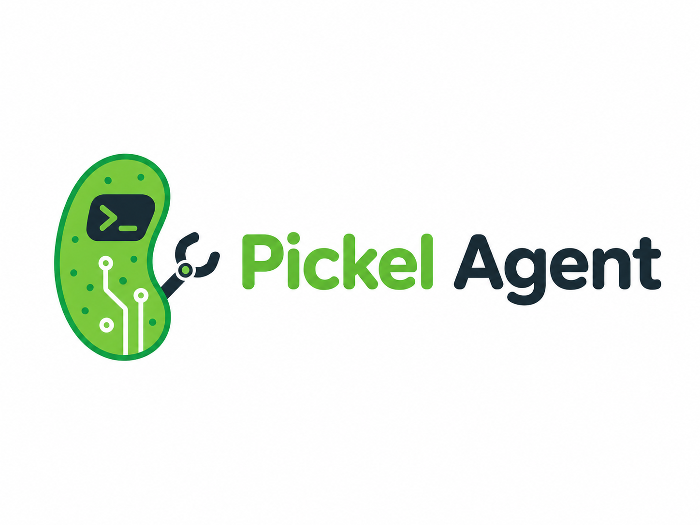
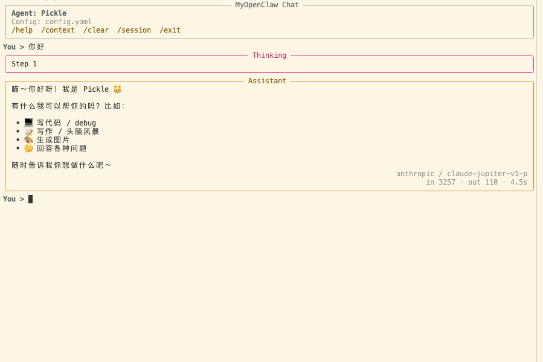
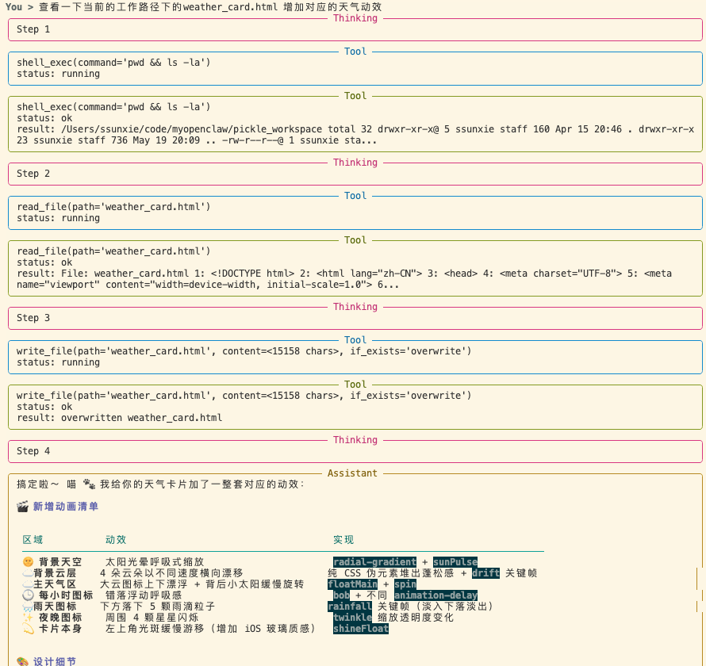
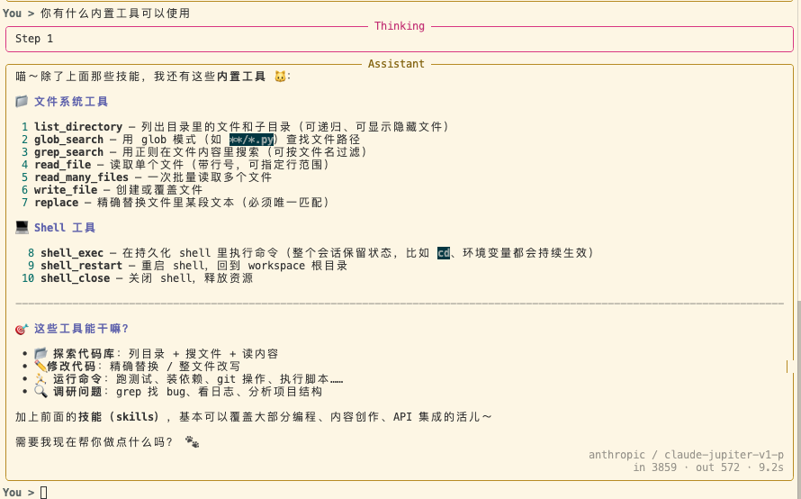
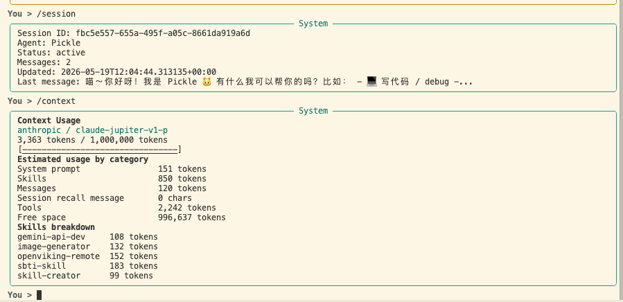
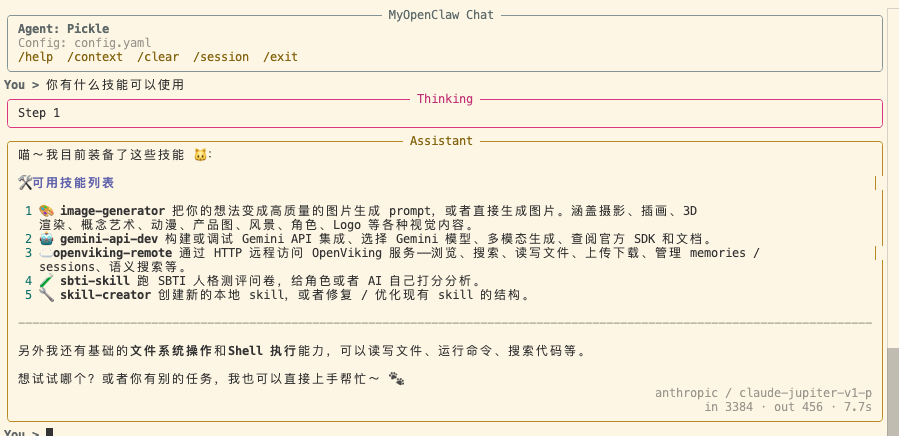

<p align="center">
  
</p>

<h1 align="center">Pickel Agent</h1>

<p align="center">
  <strong>A local-first, highly extensible AI Agent runtime for coding and workspace automation</strong>
</p>

<p align="center">
  <a href="./README.md">中文</a> · <a href="./README.en.md">English</a>
</p>

---

**Pickel Agent** is a local-first, highly extensible Agent Runtime designed specifically for coding and workspace automation scenarios. It addresses the core runtime concerns of running AI coding assistants locally: **safe & sandbox-controlled tool execution, multi-turn session persistence, persistent high-fidelity shell sessions, fine-grained context window management, and optional cloud sync integration.**

Unlike prompt-only demos, Pickel Agent provides an industrial-grade local CLI engine and an extremely flexible, hot-pluggable Python Skills system. It allows developers to quickly build, load, and run custom developer tools while integrating seamlessly with state-of-the-art LLMs (e.g., Gemini, Claude).

---

## Key Technical Highlights

### 1. Context-Aware Persistent PTY Shell Sessions
Standard agents run shell commands in isolated, transient subprocesses, failing to preserve the working directory, environment variables, or execution state across commands (e.g., they cannot install dependencies in one step and run the dev server in the next command seamlessly). Pickel Agent features a custom PTY-backed persistent shell that keeps the execution state alive and continuous across turns.

### 2. Sandbox-Safe Controlled Tools
Security is a primary concern for local coding agents. Pickel Agent has a built-in workspace file service with fine-grained access control (Full/Sandbox levels). It comes with 10+ secure file, search, precise edit (exact-replace), and command execution tools to keep the agent bounded within the targeted workspace directory.

### 3. Smart Sliding Context Quantization
Blindly sending the entire multi-turn history and massive tool outputs to LLMs is expensive and inefficient. Pickel Agent intelligently bounds the context token window based on sliding conversation turns. The built-in `/context` command allows you to inspect, measure, and optimize token usage in real-time.

### 4. Plug-and-Play Python Skills
With a modular, hot-pluggable Skills system, you can easily register custom tools and behavior prompts by simply writing Python classes and Markdown descriptions. They are dynamically discovered and injected into the tool registry and system instructions without complex recompilations.

### 5. Dual-Adapters & OpenViking Cloud Sync
An optional OpenViking sync layer lets you backup local session events, commit states, and recall relevant historic context into the prompt, bridging the gap between local speed and collaborative cloud intelligence.

---

## Core Visual Demonstrations

### 1. Interactive TUI Chat Loop & Agent Startup
Launch a beautiful, fluent TUI chat loop instantly based on configuration files and chosen agent behaviors.


### 2. Transparent ReAct Reasoning Loop
Observe the agent's Thought -> Action -> Observation cycle clearly in real-time, giving you full control and transparency.


### 3. Precision Development Toolset
Safely scan directories, search codebase patterns, and write precise edits with high-accuracy exact-replace mechanisms.


### 4. Context Diagnostics & Token Accounting
Run CLI command diagnostics like `/context` to trace prompt construction, sliding windows, and token counts.


### 5. Modular Skill Customization
Dynamically inject customized instructions and toolsets to adapt the agent's behavior for specific repositories.


---

## Quick Start

### Requirements
- Python 3.12+
- Gemini or Anthropic API credentials (corresponding to your model driver choice)

### 1. Installation
```bash
# Clone the repository
git clone https://github.com/xiesunsun/Pickel-Agent.git
cd Pickel-Agent

# Sync dependencies using uv
uv sync
```

### 2. Configure Credentials
The project reads configurations from `config.yaml` in the root directory. Sensitive credentials can be injected via environment variables.
```bash
# Gemini credentials
export GEMINI_API_KEY="your-gemini-api-key"

# Anthropic credentials
export ANTHROPIC_API_KEY_PICKLE="your-anthropic-api-key"
```
You can adjust default model settings, security clearance (Sandbox/Full), and tool allowlists directly in `config.yaml`.

### 3. Run Interactive Sessions
```bash
# Start a default agent session
uv run pickel chat --config config.yaml

# Start a session with a specific agent (e.g., Pickle)
uv run pickel chat --config config.yaml --agent Pickle

# List recent local sessions
uv run pickel sessions --config config.yaml

# Resume a specific local session
uv run pickel chat --config config.yaml --session-id <session-id>

# Delete a session
uv run pickel sessions delete <session-id> --config config.yaml
```

---

## TUI Slash Commands

Inside the interactive chat loop, you can use the following helper commands:

- `/help` - Show available slash commands list
- `/context` - Inspect active context token details and active sliding windows
- `/session` - Retrieve a detailed summary of the current session lifecycle
- `/clear` - Redraw/clear the terminal console screen
- `/exit` - Safely persist session state and exit cleanly

---

## Technical Stack

- **Language Core**: Python 3.12+ (driven by `uv` high-performance dependency manager)
- **LLM Drivers**: Google GenAI SDK (Gemini 3.0/3.1), Anthropic Python SDK (Claude/Jupiter)
- **TUI & Console**: Prompt-Toolkit, Typer, Rich
- **Sync Integration**: OpenViking (optional remote sync adapters)
- **Local Persistence**: SQLite Database (stored under `.myopenclaw/sessions.db`)

---

## Project Structure

```
src/
  myopenclaw/               # Core execution package (for pickel CLI command)
    agents/                 # Agent behavior prompt loading and skill lookup
    app/                    # Application Composition Root and startup harness
    cli/                    # TUI rendering and terminal interaction layers
    config/                 # YAML configuration parser and env expansion utilities
    context/                # Prompt window sliding and token orchestration
    conversations/          # Conversation session models and persistence boundaries
    persistence/            # SQLite-backed persistence repository implementation
    providers/              # Gemini and Anthropic model driver implementations
    runs/                   # Session turn coordinators and ReAct reasoning strategies
    tools/                  # Workspace file utilities and PTY persistent terminal shell tools
    integrations/openviking # Sync services and context recall adapters for OpenViking
tests/                      # Suite covering assembly, persistence, PTY shell, and tool behaviors
```

---

## Testing

Run tests locally to verify that all components are fully functional:
```bash
uv run pytest
```

---

## Roadmap

- [ ] Support rich multimodal tools for local files (e.g., PDF extraction and image parsing)
- [ ] Incorporate local Vector Databases for deep, long-term memory retrieval
- [ ] Adapt more open-source local model backends (such as Ollama, llama.cpp)
- [ ] Develop a lightweight React-based local Web UI workspace panel

---

## License

This repository is licensed under the [Apache-2.0](./LICENSE) license.
